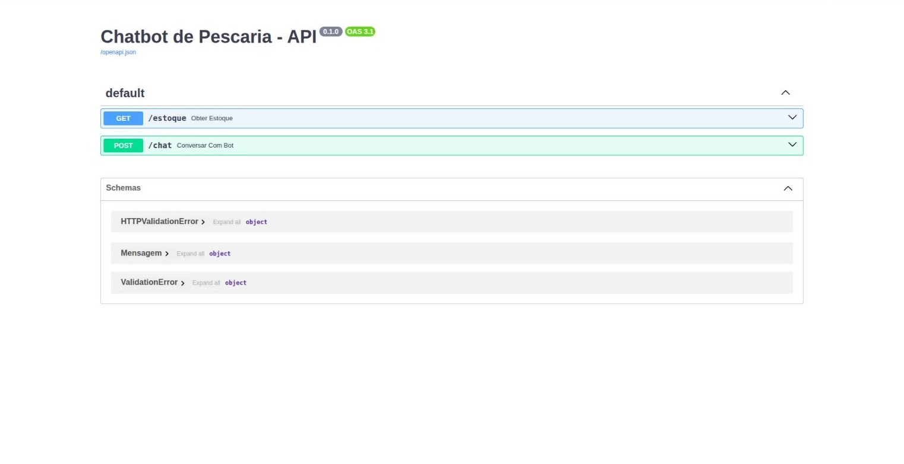

# 🐟 Chatbot - Peixaria Pantaneira (Corumbá/MS)

Um sistema (Fullstack) de chatbot desenvolvido para um teste técnico. O sistema permite que os clientes consultem o estoque de peixes por meio de uma interface amigável em React, que se comunica com uma inteligência artificial (Google Gemini) alimentada por um banco de dados SQLite.

## 🚀 Tecnologias Utilizadas

**Backend:**
* Python
* FastAPI (API rápida e moderna)
* SQLite (Banco de dados leve e embutido)
* Google Generative AI (Gemini 3.5 Flash)
* Pytest (Testes automatizados)

**Frontend:**
* React.js
* Vite (Ferramenta de build rápida)
* Axios (Requisições HTTP)
* CSS puro para estilização responsiva

## 🏗️ Modelagem da Tabela: `estoque_peixes`

A tabela é responsável por armazenar a variedade de peixes disponíveis na peixaria e o controle em tempo real de suas respectivas quantidades em estoque.

### Estrutura de Colunas (Dicionário de Dados)

| Nome da Coluna | Tipo de Dado | Restrições / Atributos | Descrição |
| :--- | :--- | :--- | :--- |
| **id** | `INTEGER` | `PRIMARY KEY`, `AUTOINCREMENT` | Identificador único e exclusivo de cada peixe no banco de dados. |
| **nome** | `TEXT` | `NOT NULL` | Nome popular do peixe pantaneiro. |
| **quantidade** | `INTEGER` | `NOT NULL` | Quantidade disponível em estoque (em unidades ou kg). |

---

## 📈 Carga Inicial de Dados (Seed)

O script de inicialização (`database.py`) limpa a tabela para evitar duplicidade e realiza a inserção dos 10 peixes pantaneiros mais comercializados na região de Corumbá/MS.

Abaixo estão os dados inseridos por padrão na tabela `estoque_peixes`:

| ID | Nome do Peixe | Quantidade Inicial em Estoque |
| :---: | :--- | :---: |
| 1 | Pacu | 150 |
| 2 | Pintado | 85 |
| 3 | Dourado | 40 |
| 4 | Cachara | 60 |
| 5 | Curimbatá | 200 |
| 6 | Piapara | 120 |
| 7 | Piau | 180 |
| 8 | Traíra | 90 |
| 9 | Barbado | 35 |
| 10 | Jaú | 15 |

---

## 📋 Pré-requisitos (Requisitos do Sistema)

Antes de começar, você precisará ter as seguintes ferramentas instaladas no seu computador:

1. **[Python 3.10+](https://www.python.org/downloads/)**
2. **[Node.js e npm](https://nodejs.org/)** (Para rodar o frontend em React)
3. **Chave da API do Google Gemini** (Pode ser gerada gratuitamente no [Google AI Studio](https://aistudio.google.com/))

---

## ⚙️ Configuração e Instalação

### Configure as variáveis de ambiente:
Crie um arquivo chamado .env na pasta raiz do projeto e adicione a sua chave da API do Gemini:
```bash
GEMINI_API_KEY=sua_chave_secreta_aqui
```

### 1. Preparando o Backend (Python)

Abra o terminal na pasta raiz do projeto e siga os passos:

Crie e ative o ambiente virtual:

#### No Windows
```bash
python -m venv venv
venv\Scripts\activate
```
#### No Linux/Mac
```bash
python3 -m venv venv
source venv/bin/activate
```
Instale as dependências do Python:
```bash
pip install fastapi uvicorn google-genai python-dotenv pytest httpx
```
#### Crie e popule o banco de dados inicial:
```bash
python database.py
```
### 2. Preparando o Frontend (React)
Abra outro terminal, navegue até a pasta do frontend e instale as dependências:
```bash
cd frontend
npm install
```
## ▶️ Como Executar o Sistema
Para que o projeto funcione corretamente, você precisará deixar dois terminais rodando simultaneamente.

### Terminal 1: Iniciando o Backend (FastAPI)
Na pasta raiz do projeto (com o ambiente virtual ativado), execute:
```bash
uvicorn main:app --reload
```
### Terminal 2: Iniciando o Frontend (React)
Na pasta frontend, execute:
```bash
npm run dev
```
## 📄 Documentação da API (Swagger)

Abaixo está a interface do Swagger gerada para este projeto:



## 🧪 Como Rodar os Testes
Este projeto inclui testes automatizados (Testes Unitários de Banco de Dados e Testes de Integração de API). Para executá-los, certifique-se de que o ambiente virtual está ativado e, na pasta raiz, execute:
```bash
pytest
```

## ⚠️ Nota Importante sobre os Testes:
Se o seu terminal retornar um erro AssertionError: {'detail': "429 RESOURCE_EXHAUSTED... durante os testes, isso não é um erro do código! A camada gratuita da API do Gemini possui um limite de requisições por minuto. Aguarde cerca de 10 a 15 segundos e rode o comando pytest novamente.


